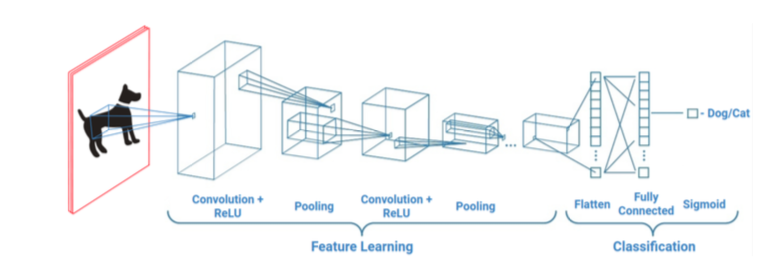

# Dogs Versus Cats: A Convoluted Approach
## Introduction
Convolutional Neural Networks (ConvNets or CNNs) are biologically-inspired variants of Multilayer Perceptrons. ConvNets roughly mimic the architecture of the mammalian visual cortex, wherein they are spatially organized similarly to a retinotopic map, and convolutional and pooling layers resemble the simple and complex receptive fields of cortical cells, respectively. This organization allows ConvNets to exploit the compositional hierarchies of natural signals. In other words, this class of feedforward neural networks is designed to process data that has a known, grid-like topology, such as that found in an image (i.e. composed of multiple two-dimensional arrays with varying pixel colour channel intensities). A typical ConvNet is structured by a series of convolutional (followed by non-linearities), pooling and fully-connected layers (shown below). 

## Abstract
This work offers a high-level overview of some of the conceptual and mathematical underpinnings of Convolutional Neural Networks (ConvNets). Techniques for improving network accuracy while preventing overfitting (such as data augmentation and regularization) are also discussed. All of these concepts are then put into practice by building an image classifier designed to distinguish between dogs and cats using a limited portion (only 8%) of the Kaggle dataset. The effects of data augmentation and network architecture on performance are examined, and results indicate that models with greater entropic capacity and extensive image modification demonstrate improved accuracy at the cost of time and computational resources.

## Implementation Details
The ConvNets were built with Keras (version 2.0.6) using a TensorFlow backend (version 1.1.0). The datasets of 25,000 cat and dog images were obtained from [Kaggle](https://www.kaggle.com/c/dogs-vs-cats/data), which offered a subset of the three million images from Microsoft Research's HIP (Human Interactive Proof) Asirra (Animal Species Recognition for Restriction Access). However, only 1,000 and 400 images of each class were used for training and validation data, respectively. 

#### See More
Read the full paper [here](DogsVCats.pdf).

#### Acknowledgements
The author would like to thank Dr. Suzanna Becker, Principal Investigator of the [Neurotechnology & Neuroplasticity Lab](https://www.science.mcmaster.ca/pnb/department/becker/index.html) at McMaster University, for her guidance and support in the undertaking of this project.

#### Author
Michael Balas

#### License
[GNU General Public License](../LICENSE)

