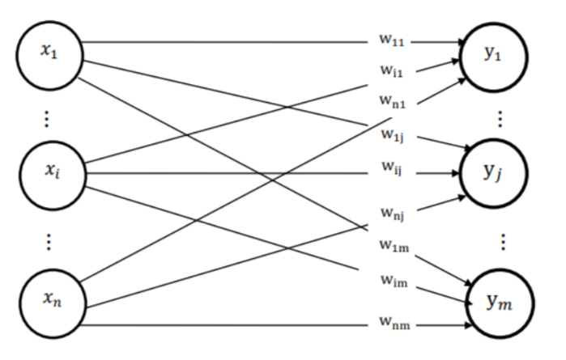

# A Comparative Analysis of Hebbian and Widrow-Hoff Learning
## Introduction
The Pattern Associator is one of the simplest types of neural networks, providing a basic model of the human brain by storing and associating similar patterns. There are two types of associative memory networks: **(i)** Auto-Associative Memory, where the input and output vectors are the same, and **(ii)** Hetero-Associative Memory, where they are different. In this work, feedforward Hetero-Associative Memory neural networks are explored, with the patterns represented as a binary system of on (1) and off (0) signals. The architecture of this model is shown below.

## Abstract
This work seeks to build upon existing literature by offering quantitative comparisons in the performance between the Hebbian and Widrow-Hoff (delta) learning algorithms for training Hetero-Associative neural networks to recall binary patterns. The delta rule was found to be 21% more accurate than the Hebb rule on average after 10 patterns, upon which both networks begin producing severe recall errors. The delta rule became more accurate with increasing input neurons, while the opposite effect was observed with the Hebb rule. The number of output neurons did not affect the accuracy of either model. Based on the results presented in this repository, along with similar findings in previous studies, the delta rule is a much more effective learning algorithm.

## Implementation Details
All of the code for the neural networks with each learning algorithm and performance metric is hand-written (i.e. no external libraries are used) in Matlab. 

#### See More
Read the full paper [here](HebbVsDelta.pdf).

#### Acknowledgements
The author would like to thank Dr. Suzanna Becker, Principal Investigator of the [Neurotechnology & Neuroplasticity Lab](https://www.science.mcmaster.ca/pnb/department/becker/index.html) at McMaster University, for her guidance and support in the undertaking of this project.

#### Author
Michael Balas

#### License
[GNU General Public License](../LICENSE)

